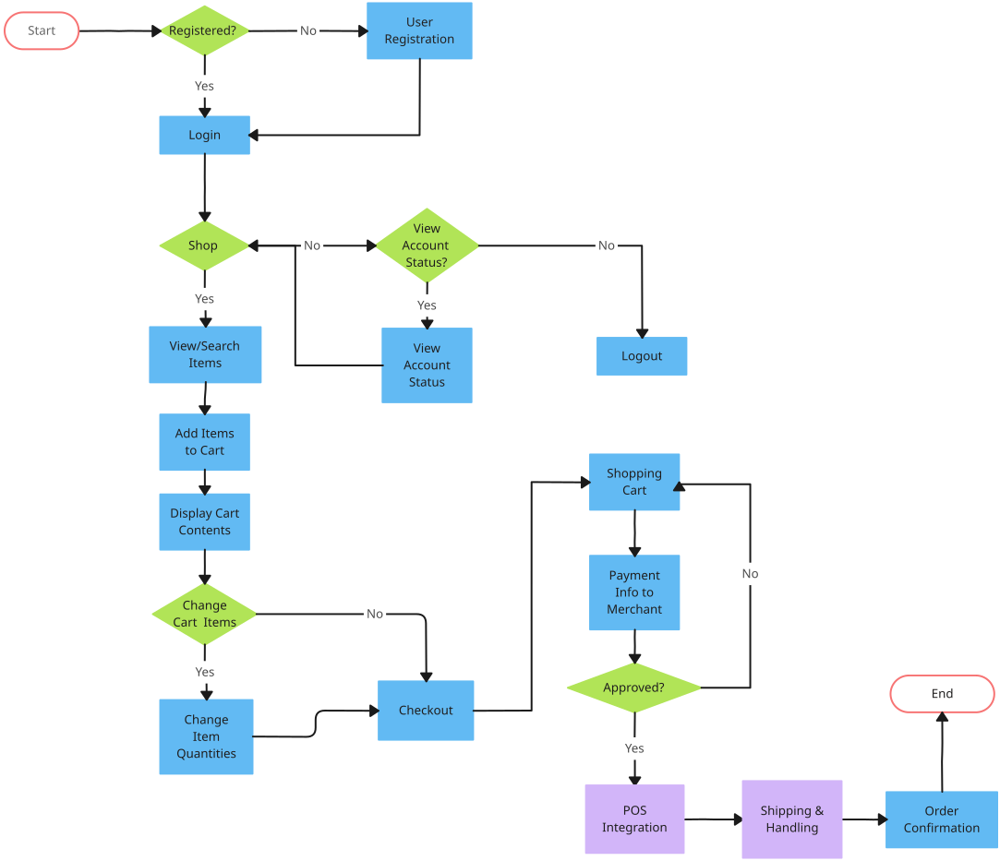

<h2>Flow</h2>

### Overview

The aim of this repository is implementing an interface to register functions that then can be used in a flow programming interface. 

### Motivation

Within organisations issues often arise due to miscommunications between departments implementing technologies and the departments using it. The aim of this project is to allow the users of technologies more control over high level behaviour without sacrificing developer control. 

### Abstract

    

Example for instruction notation. A instruction may only have a single branch going into it. (multiple input branches would imply implict duplicate) The parameters are declared to reference a variable. Only variables in scope may be selected (in scope means compiler process can ensure that the variable has at least been initialized by the time it's called).

    

Example for merger notation. Once any task reaches a merge point, it sends a data over a channel to inform a manager task to queue the output task. When both inputs to the merge exist (assigned by pairs) the output task is scheduled.

    

A splitter is much more simple in comparision, simple once a task reaches a split point, it schedules two new tasks for both L and R.

    

Example for gate notation. Gate's can be used to inform that compiler that we should wait another task to reach some point before continuing. (Repeat behaviour should be configurable, i.e. if gate should be considered oneshot or should await to task cross it.)

### Abstract (Not really accurate for new model)

Below is an example of a flowchart used for programming. It specifies an entry point and exit, along with notation for function calls and conditional branching logic.

Here's an example of the notation used within this project.

There are a few key differences in our notation that help indicate our general approach. First, notice that we do not define an entry and exit point. All function calls that are defined without some dependent call will be evaluated, and once no more work is needed we exit. Second, notice that we avoid having different node types. Instead, every node can be viewed as a function with n possible outputs. For example, the **eq** function evaluates the length of users, if it's 0 the logic branches off to the function **report_none**. Otherwise, it branches off to **iterate user** where it will branch either to **send_count** or **incr**. 

You may notice that we do not specify how data is manged in our example, often edges denote the transfer of data (implicitly defining dependencies). In this project we view the edges rather as strictly defining the order of execution. As a result, we define that all evaluated data is accessible. 

Below are the important terms used within this project.

**Instruction**: A registered function that can be included in a procedure to be dynamically executed.

**Procedure**: A set of instructions that allows our program to execute the user defined operations. 

**Instruction Group**: A subset of instructions within a procedure that may be evaluated at any time. 

**Variable**: ...

**Context**: An immutable map that is provided to each instruction in a procedure. It is created for each procedure call and therefore can allow controlled access to more complex input. For example, the body of a HTTP request.

**Slots**: A mutable array that stores the inputs and outputs for each instruction in a procedure. 

**Local**: A mutable structure that each instruction may mutate each time it's executed. It's unique to each instruction defined in the procedure.

**Runtime Error**: An error that occurs during procedure execution

**Compilation Error**: An error that occurs during procedure compilation
